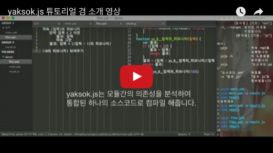

한글 프로그래밍 언어 [약속](http://yaksok.org/)을 다루기 위한 자바스크립트 라이브러리입니다.

## 직접 돌려보기

먼저 nodejs를 설치하세요.

* osx: [brew](http://brew.sh/) 설치 후 `brew install node`
* windows: [chocolatey](https://chocolatey.org/) 설치 후 `choco install nodejs`
* ubuntu: `sudo apt-get install nodejs npm`

1. `cd 저장소_최상위_폴더`
2. `npm install`
3. `npm run build` or `npm run watch`

## 빌드 명령어

* `npm run build` 개발용 빌드 및 테스트를 수행합니다.
* `npm run watch` 파일이 수정될 때마다 알아서 다시 빌드합니다.
* `npm run clean` 빌드된 파일을 다 지웁니다.
* `npm run min` 실제로 배포할 코드를 빌드합니다.

## 소스코드 라이센스
zlib 라이센스 하에 배포합니다. `LICENSE` 파일을 보세요.
